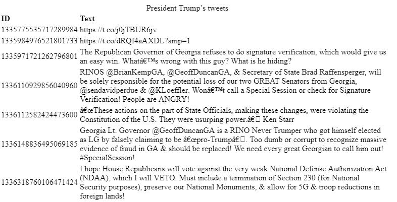
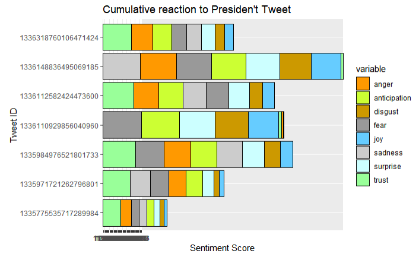
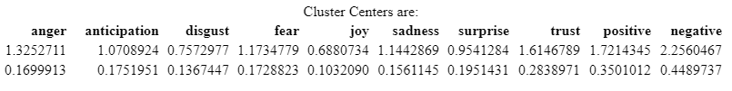
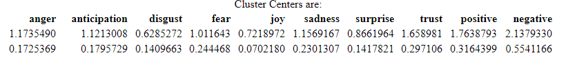
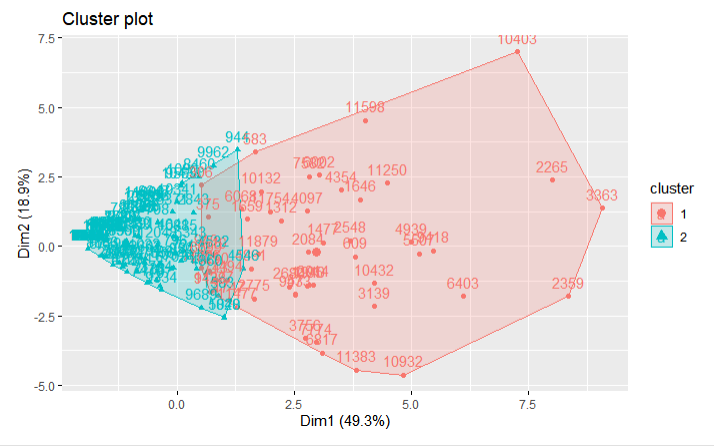
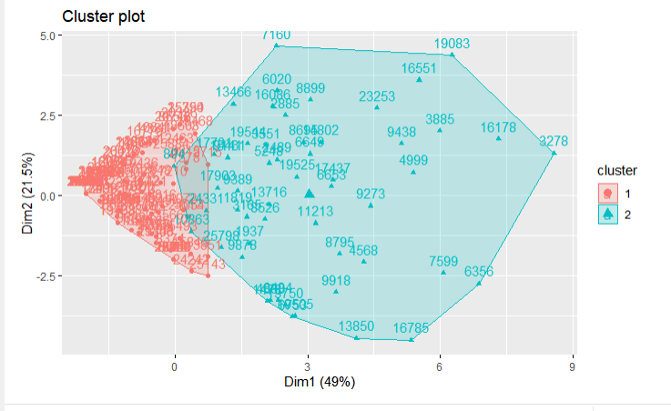
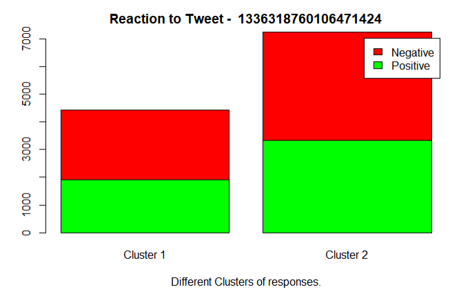
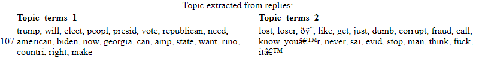
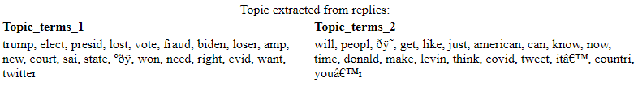
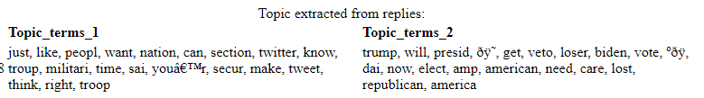

```{r setup, include = FALSE}
library("papaja")
knitr::opts_chunk$set(echo = TRUE)
r_refs("final report resources/r-references.bib")
```

```{r analysis-preferences, include = FALSE}
# Seed for random number generation
set.seed(42)
knitr::opts_chunk$set(cache.extra = knitr::rand_seed)
```


### Introduction

This study explores sentiments driven through Tweets of famous people and the contexts related to these sentiments. As observed during recent Presidential elections of the United States and often heard in political commentary, public opinion remains divisive and it seems to be ever increasing with social media platforms becoming the progenitor and proliferator of this divide. 

 Social media platforms like Twitter, Facebook, Google search, etc. wield an ever-increasing influence on our society and its opinions. Numerous recent congressional hearings over antitrust and election meddling involving such platforms would be a testament to that influence.
Everyday numerous political hashtags emerge, a few of which snowball into big political movements.

As potent as these platforms are, they are often rife with fake news and propogandas.  Coupled with behaviourally- conditioned, AI-driven news aggregation and streaming, they wield strong clout in forming and guiding public opinions towards extremes. 

Numerous studies over the years like @A__2016 and @inproceedings have employed techniques of Natural language processing (NLP) and Machine Learning (ML). To solve the problem of analyzing sentiment in a small text of a tweet. @inproceedings had employed and built upon numerous techniques based off of earlier works and provided a comparative analysis of popular ML techniques like Naive Bayes, Bi-grams, Support Vector Machines.

Almost all of the studies I have reviewed, followed a popular hashtag or Tweets of a user over a large period of time to have sizable data sufficient for analysis. This study however, employs many of these well established methods, over a singular context to explore how a tweet is perceived by different sections of society and how these different perceptions may drive different opinions.

Techniques and models developed in this endeavor could be used for further research on the topic of social influences with different themes. Social feedback on any policies, approval ratings of sitting president to Big brother next vote out. Such models could also be used to prioritizing fact checking tweets which rank higher on say certain topics or having more polarizing effects in communities.


### Research Question

The primary objective of this study is to explore the different sentiments driven by President Trump over Twitter and try to understand these affects within the tweets’ political or social context.
The study explores the responses on President Trump’s tweets and tries to understand if these replies exhibit any polarization or factions.


President Trump:

> “My use of social media is not Presidential - it’s MODERN DAY PRESIDENTIAL. Make America Great Again!”

\raggedleft
-- President Donald Trump (via twitter \@realDonaldTrump).  


### Method 


#### Data

President Donald Trump is perhaps the most prolific tweeters among modern-day world leaders. In his fourth year, he averages staggering 33.2 tweets per day^[http://www.trumptwitterarchive.com/archive]! He has tweeted over 51,000 times over the last five years^[https://www.trackalytics.com/twitter/profile/realdonaldtrump/]. He has truly embraced social media like no other leader before or present. 

Expectedly, because of his post as one of the most influential leaders in the world and his prolific usage of twitter, his tweets have already been a topic of numerous studies and articles. A slew of such articles - @Keown2020survey and @Liu2019trump and papers like @kleczka2020effect and @ge2018stock became motivation towards this study.


This study employs Twitter’s fresh off the oven API v2 to download recent President’s Trumps’ tweet from his personal handle  \@realDonaldTrump, other twitter metadata like - likes, retweets, quotes and the replies of other users on the tweet.
Most of his recent tweets are regarding results of the presidential election, claims of the voter fraud and possible recounting of votes. All these tweets have triggered contrasting responses from Republicans and democrats alike and many of these choses to flock to the president's twitter handle to denote their opinions on his posts.

A separate python [script](https://github.com/Sandeep-Joshi/twitter_api/blob/main/TwitterUsers.py) was used to scrape this data and create a csv files for President's tweets and another csv file type to store different reply threads.

Some of the tweets had over 80k replies!

#### Approach

1. My study would employ the Syuzhet package in R for sentiment analysis and classification of the replies. 
2. It would then employ cluster analysis to break the sentiment space into two clusters - one who supports/ agrees with President Trump and a cluster who doesn’t.
3. I would then explore the positivity and negativity associated with these clusters.
4. And lastly, I would perform topic modelling to understand the context of these sentiments.


###  Procedure


```{r include=FALSE, echo=FALSE}
#### Load the libraries + functions
library(files)
library(googleLanguageR)
library(tidytext)
library(stringr)
library(tidyr)
library(tm)
library(syuzhet)
library(topicmodels)
library(tidyverse)
library(slam)
library(textstem)
library(reshape2)
library(reticulate)
library(cluster)
library(factoextra)
library(ggplot2)
library(reshape2)
library(viridis)
library(hrbrthemes)
library(knitr)
library(dplyr)
library(papaja)
```

```{r include=FALSE, echo=FALSE}
options(scipen = 999)
```


####  Load Data scraped in python in R
```{r eval=FALSE}
replies_index = list.files('replies')

# load tweet and its replies.
tweets_df <-  read.csv2('Practice Tweets.csv', stringsAsFactors=FALSE, sep = ',', numerals = c("no.loss"))
tweets_df[,c('ID')] <- sapply(tweets_df[,c('ID')], as.String)
tweets_df$Topic_terms_2 = tweets_df$Topic_terms_1 = ''  # instantiate new column for storing Topic models
```


```{r include=FALSE, eval=FALSE, echo=FALSE}
#### Save/ Load the Data models which takes long time to churn out
# save.image("~/all_data.RData")
load("~/all_data.RData")
#load("~/final_run.RData")
```


#### Clean Data
```{r eval=FALSE}
# Clean tweets
clean_replies <- function(reply) {
  clean_tweet <- str_remove_all(reply, "@.*?(\\s+?|$)|^RT |http.*?(\\s+?|$)") # To remove @twitter handles and Retweet tag.
  clean_tweet <- tolower(clean_tweet)
  clean_tweet <- str_squish(str_trim(clean_tweet))
  # Not removing punctuations as some libraries use emoticons to analyze tweets
  clean_tweet <- removeWords(clean_tweet, stopwords('en')) # delete stopwords from text
  clean_tweet <- stem_strings(clean_tweet) # stemming. Might need to remove it as it can confuse certain sentiment analyses
  return(clean_tweet)
}
```

#### Check if we have reply data for the Tweet
```{r eval=FALSE}
# Check if we have replies data for the tweet using conversation id
check_replies <- function(tweet) {
  reply_file = paste0(tweet[,3], ".csv")
  if (reply_file %in% replies_index){
    # reply found, work with tweet
    cat("Tweet: ", tweet[,8], " ")
    cat("Likes: ", tweet[,7], "and Retweets: ", tweet[,6], ". ")
    reply_file <- paste0('replies/', reply_file)
    cat("Found replies file: ", reply_file)
    reply_df <- read.csv(reply_file)
    cat("Number of replies found: ", nrow(reply_df), ". \n")
    reply_df$Text <- lapply(reply_df$Text, clean_replies)
    return(reply_df)
  } 
  else {
    return(NULL)
  }
}
```


#### Running sentiment analysis on tweets
```{r eval=FALSE}
sentiment_score <- function(tweet) {
  # Syuzhet. Other methods are “bing”, “afinn”, “nrc”, and “stanford”
  # browser()
  return(get_nrc_sentiment(tweet))
}

# Topic modeling on tweets to 2 topics
topic_model <- function(tweet_col) {
  reply_corpus <- Corpus(VectorSource(tweet_col))
  # Stemming, stop words have been taken care of earlier
  import_mat <- DocumentTermMatrix(reply_corpus, control = list(stemming =TRUE,
                                                                stopwords = TRUE,
                                                                minWordLength = 3, # This keeps the data out of sync
                                                                removeNumbers = TRUE,
                                                                removePunctuation =TRUE))
  import_weight = tapply(import_mat$v/row_sums(import_mat)[import_mat$i], 
                       import_mat$j, 
                       mean) *
    log2(nDocs(import_mat)/col_sums(import_mat > 0))
  
  #ignore very frequent and 0 terms
  import_mat = import_mat[ row_sums(import_mat) > 0, ]
  
  # 2 topics and random seed of 7
  LDA_gibbs = LDA(import_mat, k = 2, method = "Gibbs", 
                control = list(seed = 7, burnin = 1000, 
                               thin = 100, iter = 1000))
  # See Topic modelings values to verify all indicators are within control and expected range
  cat("LDA Gibb's Alpha: ", LDA_gibbs@alpha, 
      "entropy: ", mean(apply(posterior(LDA_gibbs)$topics, 1, function(z) - sum(z * log(z)))))
  
  # Return lists from models so that they can be added to df. Complete model doesn't work
  return(list("topics" = tidy(LDA_gibbs, matrix = "gamma"), "terms" = terms(LDA_gibbs, 20)))
}
```

####  Topic modelling over entire corpus of replies on a single tweet.
```{r eval=FALSE}
get_all_modeling_data <- function(tweet_id) {
    
    sprintf("For tweet id: %s ", tweet_id)
    replies = check_replies(tweets_df[tweets_df$ID == tweet_id,])
    # Delete blank replies as this causes issues later on with DF operations.
    replies <- replies[!grepl("^\\s*$",replies$Text),]
    
    if (!is.null(replies)) {
      replies$Topic_category <- 0
      # Do sentiment analysis for each reply
      replies <- cbind(replies, bind_rows(lapply(replies$Text, sentiment_score)))
      sprintf("Sentiment analysis done for all replies on Tweet %s\n", tweet_id)
      
      # Do Topic modeling for all replies.
      temp_model <- topic_model(replies$Text)  
      
      # Add top terms in all replies corpus to Tweet data
      Topic_terms_1 <- toString(temp_model$terms[,1])
      Topic_terms_2 <- toString(temp_model$terms[,2])

      
      # Add Topic category to the reply, determined by highest beta value. Equal values are not classified.
      temp_topics <- temp_model$topics %>% group_by(document) %>% 
        filter(gamma==max(gamma)) %>% 
        arrange(document, topic)
      temp_topics <- temp_topics %>% filter(gamma != 0.5000000) %>% select(document, topic)
      
      for (j in 1:nrow(replies)) {
        replies[j,]$Topic_category <- toString(temp_topics[temp_topics$document==toString(j),]$topic)
      }
      
      # remove temp_model from memory to save space
      rm(list=c('temp_model', 'temp_topics'))
      
      sprintf("Topic Modelling done for Tweet %s", tweet_id)
      return(list("replies"=replies, "topic_terms1"=Topic_terms_1, "topic_terms2"=Topic_terms_2))
    }
}
```

####  Running my model on Presidential Tweets between Dec 07th and Dec 08th 2020 
```{r eval=FALSE}
# Tweet: 1335775535717289984
tweet_id = '1335775535717289984'
temp_reply <- get_all_modeling_data(tweet_id)
reply_model_1335775535717289984 <- temp_reply$replies
tweets_df[tweets_df$ID == tweet_id,]$Topic_terms_1 <- toString(temp_reply$topic_terms1)
tweets_df[tweets_df$ID == tweet_id,]$Topic_terms_2 <- toString(temp_reply$topic_terms2)


# Tweet: 1335971721262796801
tweet_id = '1335971721262796801'
temp_reply <- get_all_modeling_data(tweet_id)
reply_model_1335971721262796801 <- temp_reply$replies
tweets_df[tweets_df$ID == tweet_id,]$Topic_terms_1 <- toString(temp_reply$topic_terms1)
tweets_df[tweets_df$ID == tweet_id,]$Topic_terms_2 <- toString(temp_reply$topic_terms2)

# Tweet: 1335984976521801733
tweet_id = '1335984976521801733'
temp_reply <- get_all_modeling_data(tweet_id)
reply_model_1335984976521801733 <- temp_reply$replies
tweets_df[tweets_df$ID == tweet_id,]$Topic_terms_1 <- toString(temp_reply$topic_terms1)
tweets_df[tweets_df$ID == tweet_id,]$Topic_terms_2 <- toString(temp_reply$topic_terms2)

# Tweet: 1336148836495069185
tweet_id = '1336148836495069185'
temp_reply <- get_all_modeling_data(tweet_id)
reply_model_1336148836495069185 <- temp_reply$replies
tweets_df[tweets_df$ID == tweet_id,]$Topic_terms_1 <- toString(temp_reply$topic_terms1)
tweets_df[tweets_df$ID == tweet_id,]$Topic_terms_2 <- toString(temp_reply$topic_terms2)

# Tweet: 1336318760106471424
tweet_id = '1336318760106471424'
temp_reply <- get_all_modeling_data(tweet_id)
reply_model_1336318760106471424 <- temp_reply$replies
tweets_df[tweets_df$ID == tweet_id,]$Topic_terms_1 <- toString(temp_reply$topic_terms1)
tweets_df[tweets_df$ID == tweet_id,]$Topic_terms_2 <- toString(temp_reply$topic_terms2)

# Tweet: 1336110929856040960
tweet_id = '1336110929856040960'
temp_reply <- get_all_modeling_data(tweet_id)
reply_model_1336110929856040960 <- temp_reply$replies
tweets_df[tweets_df$ID == tweet_id,]$Topic_terms_1 <- toString(temp_reply$topic_terms1)
tweets_df[tweets_df$ID == tweet_id,]$Topic_terms_2 <- toString(temp_reply$topic_terms2)


# Tweet: 1336112582424473600
tweet_id = '1336112582424473600'
temp_reply <- get_all_modeling_data(tweet_id)
reply_model_1336112582424473600 <- temp_reply$replies
tweets_df[tweets_df$ID == tweet_id,]$Topic_terms_1 <- toString(temp_reply$topic_terms1)
tweets_df[tweets_df$ID == tweet_id,]$Topic_terms_2 <- toString(temp_reply$topic_terms2)

```

#### Calculate sentiment metadata for Tweet
```{r eval=FALSE}
tweet_ids <- c('1335775535717289984', '1335971721262796801', '1335984976521801733', '1336148836495069185', '1336318760106471424', '1336110929856040960', '1336112582424473600')
meta_cols <- c('anger', 'anticipation', 'disgust','fear','joy','sadness','surprise','trust','positive','negative')


replies_metadata_df <- data.frame(row.names = c('id', meta_cols))

for (tweet_id in tweet_ids) {
  temp_reply_df <- get(paste0('reply_model_', tweet_id))
  # If they get more re-tweet or likes we should multiple emotion (?)
  replies_metadata_df <- rbind(replies_metadata_df, lapply(c('id'=tweet_id, unlist(colSums(temp_reply_df[meta_cols], na.rm = TRUE))), unlist)) 
} 

ggplot(melt(replies_metadata_df[1:9], id.vars = c('id')), aes(fill=variable, y=value, x=id)) + ggtitle("Cumulative reaction to Presiden't Tweet") + xlab("Tweet ID") + ylab("Sentiment Score") +
    geom_bar(position="stack", stat="identity", color = "black") + scale_fill_manual(values=c("#FF9900", "#CCFF33", "#CC9900", "#999999", "#66CCFF", "#CCCCCC", "#CCFFFF", "#99FF99")) + coord_flip()

# Tweets
print(kable(tweets_df[tweets_df$ID %in% replies_metadata_df$id,][,c('ID','Text')], caption = "President Trump's tweets"))
```


#### Clustering Analysis
```{r eval=FALSE}
cluster_plot <- function(tweet_id) {
  temp_reply_df <- get(paste0('reply_model_', tweet_id))
  temp_reply_df <- temp_reply_df %>% na_if("") %>% na.omit()
  # factor_cols <- c('X', 'ID', 'Topic_category')
  # temp_reply_df[factor_cols] <- lapply(temp_reply_df[factor_cols], factor)
  
  temp_reply_df <- temp_reply_df[meta_cols]

  # distance <- get_dist(temp_reply_df[meta_cols], method = "euclidean") # maximum, manhattan #causing memory issues
  # fviz_dist(distance, gradient = list(low = "#00AFBB", mid = "white", high = "#FC4E07"))
  k2 <- kmeans(temp_reply_df, centers = 2, nstart = 25)
  str(k2)
  
  # Randomly sample data for plotting Clusters
  sample_size = 200
  subsample_plot <- temp_reply_df[sample(nrow(temp_reply_df),sample_size),]
  subsample_k2 <- k2
  subsample_k2$cluster <- subsample_k2$cluster[row.names(subsample_plot)]
  
  temp_k2 <- subsample_k2
  
  subsample_plot <- fviz_cluster(subsample_k2, data = subsample_plot[meta_cols])
  
  
  # Plotting aggregate reaction to Tweet
  cluster_1 <- names(k2$cluster[k2$cluster==1])
  cluster_2 <- names(k2$cluster[k2$cluster==2])
  
  hap_table <- matrix(c(sum(temp_reply_df[cluster_1,]$positive), sum(temp_reply_df[cluster_2,]$positive),
                        sum(temp_reply_df[cluster_1,]$negative), sum(temp_reply_df[cluster_2,]$negative)), ncol = 2, byrow = T)
  colnames(hap_table) <- c("Cluster 1", "Cluster 2")
  rownames(hap_table) <- c("Positive", "Negative")
  hap_table <- as.table(hap_table)
  
  plot_happiness <- barplot(hap_table, main=paste("Reaction to Tweet - ", tweet_id), 
                            xlab ="Different Clusters of responses.", 
                            col=c("green","red"), 
                            legend = rownames(hap_table))
  
  return(list("cluster_plot" = subsample_plot, "plot_happiness" = plot_happiness, "centers" = k2$centers, "dist"= k2$size))
}
```

### Data Visualization for Tweets and topics


> Tweet: https://t.co/j0jTBUR6jv
##### Fox News piece about President Trump's claim about Pennisylvania and supporting Fedral case againt the state.
```{r eval=FALSE}
plot_data_1335775535717289984 <- cluster_plot("1335775535717289984")
```

```{r}
plot_data_1335775535717289984$cluster_plot
print(kable(plot_data_1335775535717289984$centers, caption = "Cluster Centers are:"))
print(kable(plot_data_1335775535717289984$dist, caption = "Distribution for replies in a cluster is: "))
plot_data_1335775535717289984$plot_happiness
print(kable(tweets_df[tweets_df$ID=='1335775535717289984',][,c('Topic_terms_1', 'Topic_terms_2')], caption = "Topic extracted from replies:"))
```


> "The Republican Governor of Georgia refuses to do signature verification, which would give us an easy win. What’s wrong with this guy? What is he hiding?"
```{r eval=FALSE}
plot_data_1335971721262796801 <- cluster_plot("1335971721262796801")
```

```{r}
plot_data_1335971721262796801$cluster_plot
print(kable(plot_data_1335971721262796801$centers, caption = "Cluster Centers are:"))
print(kable(plot_data_1335971721262796801$dist, caption = "Distribution for replies in a cluster is: "))
plot_data_1335971721262796801$plot_happiness
print(kable(tweets_df[tweets_df$ID=='1335971721262796801',][,c('Topic_terms_1', 'Topic_terms_2')], caption = "Topic extracted from replies:"))
```


> "https://t.co/dRQI4aAXDL?amp=1"  
##### "Proclamation on National Pearl Harbor Remembrance Day, 2020"
```{r eval=FALSE}
plot_data_1335984976521801733 <- cluster_plot("1335984976521801733")
```

```{r}
plot_data_1335984976521801733$cluster_plot
print(kable(plot_data_1335984976521801733$centers, caption = "Cluster Centers are:"))
print(kable(plot_data_1335984976521801733$dist, caption = "Distribution for replies in a cluster is: "))
plot_data_1335984976521801733$plot_happiness
print(kable(tweets_df[tweets_df$ID=='1335984976521801733',][,c('Topic_terms_1', 'Topic_terms_2')], caption = "Topic extracted from replies:"))
```


> "Georgia Lt. Governor @GeoffDuncanGA is a RINO Never Trumper who got himself elected as LG by falsely claiming to be “pro-Trump”. Too dumb or corrupt to recognize massive evidence of fraud in GA & should be replaced! We need every great Georgian to call him out! #SpecialSession!"
```{r eval=FALSE}
plot_data_1336148836495069185 <- cluster_plot("1336148836495069185")
```

```{r}
plot_data_1336148836495069185$cluster_plot
print(kable(plot_data_1336148836495069185$centers, caption = "Cluster Centers are:"))
print(kable(plot_data_1336148836495069185$dist, caption = "Distribution for replies in a cluster is: "))
plot_data_1336148836495069185$plot_happiness
print(kable(tweets_df[tweets_df$ID=='1336148836495069185',][,c('Topic_terms_1', 'Topic_terms_2')], caption = "Topic extracted from replies:"))
```


> "I hope House Republicans will vote against the very weak National Defense Authorization Act (NDAA), which I will VETO. Must include a termination of Section 230 (for National Security purposes), preserve our National Monuments, & allow for 5G & troop reductions in foreign lands!"
```{r eval=FALSE}
plot_data_1336318760106471424 <- cluster_plot("1336318760106471424")
```

```{r}
plot_data_1336318760106471424$cluster_plot
print(kable(plot_data_1336318760106471424$centers, caption = "Cluster Centers are:"))
print(kable(plot_data_1336318760106471424$dist, caption = "Distribution for replies in a cluster is: "))
plot_data_1336318760106471424$plot_happiness
print(kable(tweets_df[tweets_df$ID=='1336318760106471424',][,c('Topic_terms_1', 'Topic_terms_2')], caption = "Topic extracted from replies:"))

```


> "RINOS @BrianKempGA, @GeoffDuncanGA, & Secretary of State Brad Raffensperger, will be solely responsible for the potential loss of our two GREAT Senators from Georgia, @sendavidperdue & @KLoeffler. Won’t call a Special Session or check for Signature Verification! People are ANGRY!"
```{r eval=FALSE}
plot_data_1336110929856040960 <- cluster_plot("1336110929856040960")
```

```{r}
plot_data_1336110929856040960$cluster_plot
print(kable(plot_data_1336110929856040960$centers, caption = "Cluster Centers are:"))
print(kable(plot_data_1336110929856040960$dist, caption = "Distribution for replies in a cluster is: "))
plot_data_1336110929856040960$plot_happiness
print(kable(tweets_df[tweets_df$ID=='1336110929856040960',][,c('Topic_terms_1', 'Topic_terms_2')], caption = "Topic extracted from replies:"))
```


> "“These actions on the part of State Officials, making these changes, were violating the Constitution of the U.S. They were usurping power.” Ken Starr"
```{r eval=FALSE}
plot_data_1336112582424473600 <- cluster_plot("1336112582424473600")
```

```{r}
plot_data_1336112582424473600$cluster_plot
print(kable(plot_data_1336112582424473600$centers, caption = "Cluster Centers are:"))
print(kable(plot_data_1336112582424473600$dist, caption = "Distribution for replies in a cluster is: "))
plot_data_1336112582424473600$plot_happiness
#print(kable(tweets_df[tweets_df$ID=='1336112582424473600',][,c('Topic_terms_1', 'Topic_terms_2')], caption = "Topic extracted from replies:"))
papaja::apa_table(tweets_df[tweets_df$ID=='1336112582424473600',][,c('Topic_terms_1', 'Topic_terms_2')], caption = "Topic extracted from replies:")
```

### Results

#### Sentiments:


 

#### Cluster:


Cluster centers through the reply thread have been consistent across different tweets. These two denote two different kinds of replies but doesn't necessarily indicate any political leanings. It seems that our model classifies  people or replies based on their emotiveness which can be from either side of the fence.
A further analysis of more clustering might surface out more insights.



My clustering model shows similar distribution with all the replies in these clusters. These down-sampled clusters show more higher density in one which denoted our more poignant/ expressive responders and another cluster which shows more withheld demeanour in replies. 




All clusters in every reply show a similar pattern of slightly more negative emotions than positive.



#### Topics:

Looking at the topic extracted from the tweets, it is quite conspicuous that one of these Topic terms denote more Republican ideas and put more weight over issues like Voter Fraud, court and Trump and other group denote more democratic ideas as talk about issues like Covid and country.






Models developed in this study could be further enhanced to research on the topic of social influences with different themes. Social feedback on policies, presidents, and local government. We noticed overwhelming negative sentiments, fear and distrust in masses along with factionism. We need people who have more influence to more stringent checks and higher standards.


\newpage

\newpage

### References


\begingroup
\setlength{\parindent}{-0.5in}
\setlength{\leftskip}{0.5in}

<div id = "refs"></div>
\endgroup

\bibliographystyle{unsrt}                 
\bibliography{r-references.bib} 


  